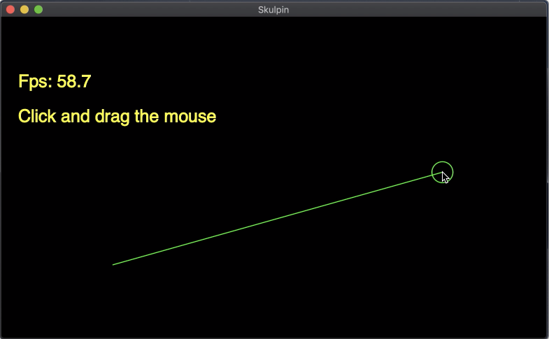

# skulpin

Skia + Vulkan = Skulpin

This crate provides an easy option for drawing hardware-accelerated 2D by combining vulkan and skia. (And a dash of 
winit!)

This crate mainly depends on:
 * [ash](https://github.com/MaikKlein/ash) - Vulkan bindings for Rust
 * [skia-safe](https://github.com/rust-skia/rust-skia) - [Skia](https://skia.org) bindings for Rust
 * [winit](https://github.com/rust-windowing/winit) - Cross-platform window handling
 
## Usage

Currently there are two ways to use this library.
 * [app](examples/skulpin_app.rs) - Implement the AppHandler trait and launch the app. It's simple but not as flexible.
 * [renderer_only](examples/renderer_only.rs) - You manage the window and event loop yourself. Then add the renderer to draw to it.
 
The [interactive](examples/interactive.rs) example is good to look at for an easy way to get keyboard/mouse input.

Don't forget to install the prerequisites below appropriate to your platform! (See "Requirements")

## Running the Examples

First, ensure that the below requirements are met depending on OS. Afterwards, the examples can be run normally:

`cargo run --example interactive`

## Requirements

### Windows

All examples require the LunarG Validation layers and a Vulkan library that is visible in your `PATH`. An easy way to get started is to use the [LunarG Vulkan SDK](https://lunarg.com/vulkan-sdk/)

### MacOS

All examples require the LunarG Validation layers and a Vulkan library that is visible in your `PATH`. An easy way to get started is to use the [LunarG Vulkan SDK](https://lunarg.com/vulkan-sdk/)

### Linux

All examples require the LunarG Validation layers and a Vulkan library that is visible in your `PATH`. An easy way to get started is to use the [LunarG Vulkan SDK](https://lunarg.com/vulkan-sdk/)

On linux you'll also need to link against bz2, GL, fontconfig, and freetype.

On ubuntu, you could use `libbz2-dev`, `libfreetype6-dev`, `libfontconfig1-dev`, and `libgl-dev`. (And `libvulkan-dev` to pick up the Vulkan SDK)

### Other Platforms

It may be possible to build this for mobile platforms, but I've not investigated this yet.

## Status

For now this is a proof-of-concept. I think there is desire for a simple entry point to drawing on the screen, and that
this approach can provide a good balance of performance, features, and ease-of-use for many applications.

Flutter, Google's new UI framework, uses a Skia + Vulkan stack to achieve 60+ FPS on mobile devices. So I expect this
type of usage to be maintained and improved as needed in the upstream libraries.

## License

Licensed under either of

* Apache License, Version 2.0, ([LICENSE-APACHE](LICENSE-APACHE) or http://www.apache.org/licenses/LICENSE-2.0)
* MIT license ([LICENSE-MIT](LICENSE-MIT) or http://opensource.org/licenses/MIT)

at your option.

### Contribution

Unless you explicitly state otherwise, any contribution intentionally
submitted for inclusion in the work by you, as defined in the Apache-2.0
license, shall be dual licensed as above, without any additional terms or
conditions.

See [LICENSE-APACHE](LICENSE-APACHE) and [LICENSE-MIT](LICENSE-MIT).
